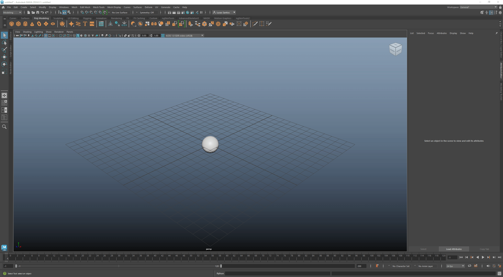

# abcAction
Maya to Unreal Alembic Export Tools

I've worked on many cinematic projects in Unreal Engine. Most notably this one [here](https://www.youtube.com/watch?v=GNJtPFXUnm4).

With every project comes the time to export all the animation from Maya and import it into Unreal. 
The tools I've made allow the process to be a lot quicker and less technical upfront.

This tool uses ALEMBIC CACHES as the file type of choice. This is because alembics are the most versatile for cinematic animation, as there is no limit on your deformers, like with FBX.

## Features

* Quickly identify desired objects for export within Maya
* Export those objects with the necessary alembic export options that work best in Unreal
* Maya UI for exporting one or multiple export locations
* Unreal UI with a simple drag-n-drop window to batch import animation

 

# Installation:
Download the ZIP file from the `<> code` button on the top right of the GitHub page.
There are two separate GUIs used. One for Maya and one for Unreal.

## **Maya**
1. After unzipping the downloaded code, navigate to the `mayaTools` folder
2. Select and drag the `DRAG-N-DROP-IN-MAYA.py` file into the Maya viewport
3. You should see a confirmation dialog and the menu on the top bar 
4. The tools are ready for use (No restart necessary)

  
Installing the Maya tool:

  

 

 

## **Unreal**
### Activate Python in your Project
1. Enable Python in your Unreal project ([Tutorial](https://youtu.be/PMOvQ7mPv8k?si=OMGj71u5L9fDlZzm&t=7))

2. After unzipping the downloaded code, navigate to the `unrealTools` folder

3. Move the `unrealTools` folder to `<Unreal_Project>/Scripts` (If you don't have a Scripts folder, make one)

4. In Unreal, go to Edit > Project Settings and type "python" in the top search bar

5. Locate `Additional Paths` in the menu and click the `+` icon next to it. Copy the path to the `unrealTools` folder and paste it in the `Additional Paths` text box.  
(IE: C:/Users/Artist/MyProject/Scripts/unrealTools)

 

NOTE: Moving the folder to your project's Scripts folder is only a suggestion. If you like, you can move the unrealTools folder wherever you prefer. Just make sure the Additional Paths location is set there. 

### Add the Blueprint
To add the Editor Utility Widget menu to your project, you must migrate it from a separate project.

1. Navigate to `unrealTools/Alembic_Import_Tool`

2. Open the `Alembic_Import_Tool.ueproject` file

3. In the project, select the `Alembic_Import_Tool` folder in the 
content browser

4. Right-click on it and click `Migrate`, then click OK

5. Navigate to the `Content` folder of the project where you want the tool, select it and click `Select Folder`

6. Go back to the project you migrated to and locate the blueprint. Right-click on it and click `Run Editor Utility Widget`

