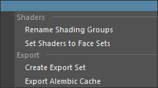
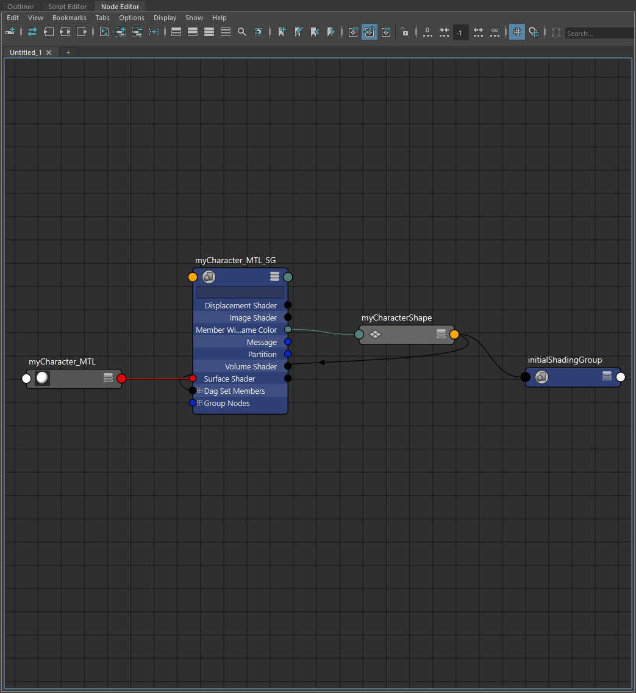
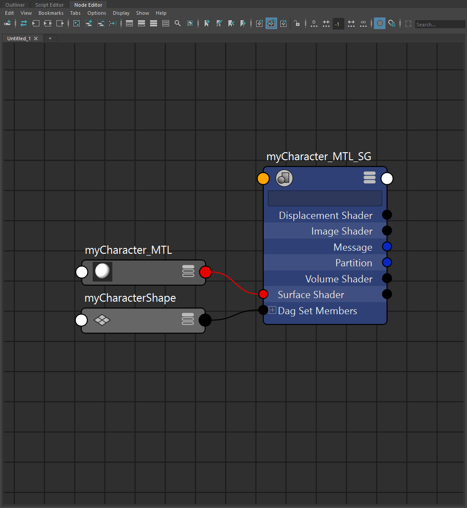
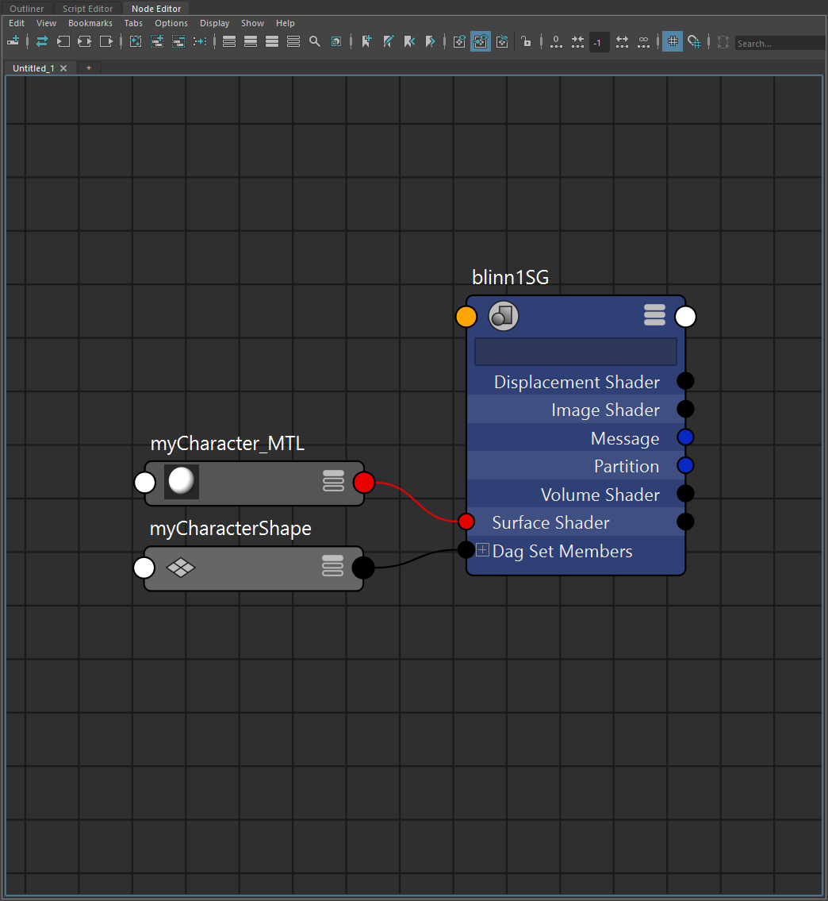
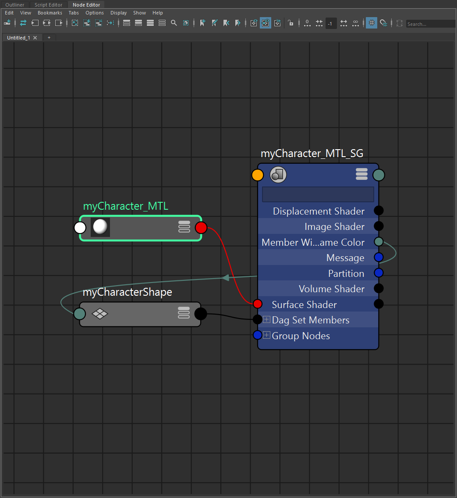
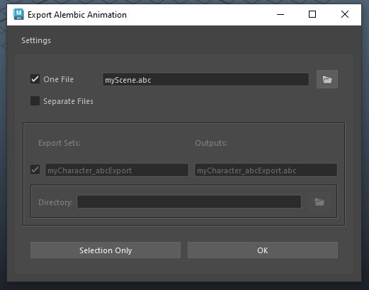
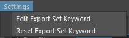
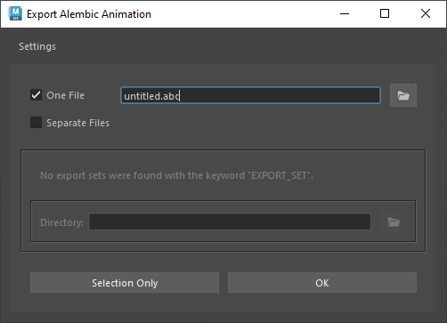
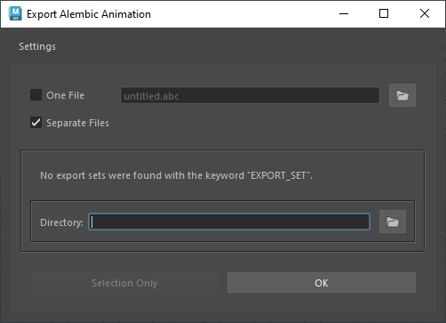
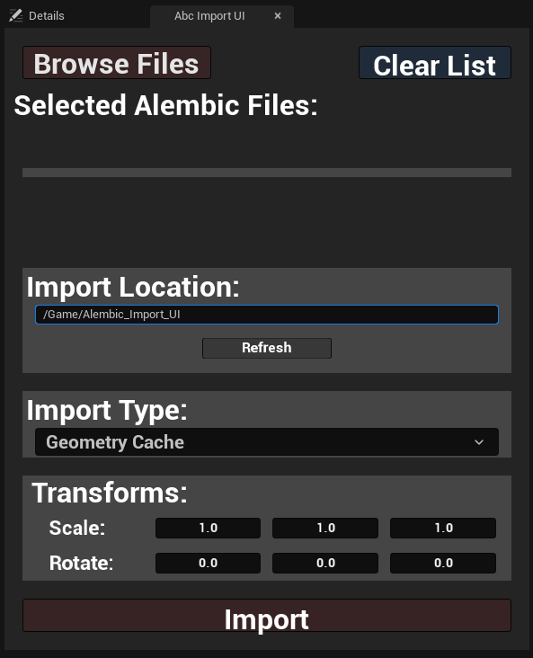

# abcAction: A Maya to Unreal Alembic I/O Tool

 

### What Does It Do?
* Quickly and easily exports alembic cache files from your Maya scene
* Allows users to batch import alembic cache files to Unreal projects efficiently

### Why?
* FBX animation must contain a skeleton, which at times can be less than ideal
* Alembics work with geometry caches, meaning any deformers from your 3D software are compatible
* This allows creative freedom to animate how you choose

### How Does it Work?
* Unreal needs certain parameters to be set in order for your alembics to import properly
* The Maya tool exports with these parameters, then the Unreal tool imports them accordingly

 

# Recommended Workflow
The easiest route to getting your animated scene from Maya into your Unreal sequencer is by following these steps:
1. Rename your shading groups to their respective material names
2. Set your asset's shaders to face sets (link face set section)
3. Create an export set of the desired assets to bring into Unreal
4. Export your scene file from Maya
5. Import your scene file to Unreal

Performing these steps ensures a speedy output of your scene from Maya and easy batch import of your alembic files to Unreal at the desired location with connected shaders and organized material naming.

 

# Installation:
Download the ZIP file from the `<> code` button on the top right of the GitHub page.
There are two separate GUIs used. One for Maya and one for Unreal.

## **Maya**
1. After unzipping the downloaded code, navigate to the `mayaTools` folder
2. Select and drag the `DRAG-N-DROP-IN-MAYA.py` file into the Maya viewport
3. You should see a confirmation dialog and the menu on the top bar 
4. The tools are ready for use (No restart necessary)

  
Installing the Maya tool:

  

 

 

## **Unreal**
### Activate Python in your Project
1. Enable Python in your Unreal project ([Tutorial](https://youtu.be/PMOvQ7mPv8k?si=OMGj71u5L9fDlZzm&t=7))

2. After unzipping the downloaded code, navigate to the `unrealTools` folder

3. Move the `unrealTools` folder to `<Unreal_Project>/Scripts` (If you don't have a Scripts folder, make one)

4. In Unreal, go to Edit > Project Settings and type "python" in the top search bar

5. Locate `Additional Paths` in the menu and click the `+` icon next to it. Copy the path to the `unrealTools` folder and paste it in the `Additional Paths` text box.  
(IE: C:/Users/Artist/MyProject/Scripts/unrealTools)

 

NOTE: Moving the folder to your project's Scripts folder is only a suggestion. If you like, you can move the unrealTools folder wherever you prefer. Just make sure the Additional Paths location is set there. 

### Add the Blueprint
To add the Editor Utility Widget menu to your project, you must migrate it from a separate project.

1. Navigate to `unrealTools/Alembic_Import_Tool`

2. Open the `Alembic_Import_Tool.ueproject` file

3. In the project, select the `Alembic_Import_Tool` folder in the 
content browser

4. Right-click on it and click `Migrate`, then click OK

5. Navigate to the `Content` folder of the project where you want the tool, select it and click `Select Folder`

6. Go back to the project you migrated to and locate the blueprint. Right-click on it and click `Run Editor Utility Widget`

 

 

 

# **Using abcAction**
# Maya Tools

In Maya, the `abcAction` menu dropdown holds all the tools needed for easy set-up and exporting of your animated scenes. Below is a list of all the functions in the menu.

 

# Apply Shader to Face Sets 

For Unreal to recognize the shaders connected to an importing alembic file, the shader must be connected via the face components. In Maya, that means your node network has to look like this: 

Rather than this: 

The difference is the way the shading group for the material you intend to use is connected to the mesh. Unreal does **not** recognize the shader if you simply assign it to the mesh object in Maya.

If any of the mesh objects you are exporting have their shaders assigned to the object, you will need to make sure to apply the shaders directly on the faces to mimic the necessary node connections. In this scenario, you must use the `Apply Shader to Face Sets` function to have the shaders hook up in Unreal.

However, if the mesh objects you're exporting **already** contain multiple shaders connected to **one mesh object** then you do not have to do anything! Objects like this already contain the desired node connections to export with the shaders correctly.

## Functionality
* Select the mesh objects you want to apply the shaders to
* Click `Apply Shaders to Face Sets` in the menu

### NOTE:
* If nothing is selected, you'll be prompted to perform the function on all objects in the scene.

* This function is non-destructive and undoable. Should any issues occur, simply undo or reapply your shaders as you had them.

* This function skips performing on meshes already containing multiple shaders applied to face components.

 

# Apply Material Name to Shaders

When importing FBX files into Unreal, the name of the materials on the imported objects is what Unreal uses to hook up to the matching Unreal materials.

For some reason, alembic caches work differently. Unreal will search for the name of the shading groups. If artists name their materials, but leave their shading groups with default names such as "standardSurface1_SG", that creates a two-fold problem. Unreal won't automatically hook up your materials to their Unreal counterparts, and it will be a guessing game when adding materials manually in Unreal, since each object will be named "standardSurface1_SG", "Blinn5_SG" and so on. 

## Functionality
* Select the objects or materials you want to modify with shading groups you want to rename.
* Renames the shading group to match the connected material and adds a suffix of "_SG"

### NOTE: 
* If nothing is selected, you'll be prompted to perform the function on all objects in the scene.

 

# Create Export Selection Set

When it comes time to export your animation to Unreal, the process of selecting each and every mesh object to be exported can get old very, very quickly. Especially when the scene contains multiple characters, props, and environments.

`Create Export Selection Set` creates a selection set of the selected objects. It is meant to be used in each asset's original file so that the selection set will appear with the referenced asset in your scene. 

## Functionality
* Select the mesh objects to add to the set
* Click `Create Export Selection Set` in the menu
* Opens a dialog prompting the user to name the set
* Creates a selection set with the given name and a suffix of "_abcExport"

### NOTE: 
* The exporter uses this naming convention when exporting a scene. If the selection set does not include the appended string "_abcExport" it will not export. 

* You can change the name of this string in the `Export Selection Sets` menu.

* The selection sets are located at the bottom of the outliner.

 

# Export Selection Set

There are a variety of different options for exporting alembic files. The export menu in `Export Selection Set` sets all the necessary options for functional animation and shading in Unreal. 

These options are:
* Strip Namespaces
* UV Write
* Write UVSets
* Write Face Sets
* Write Visibility
* Whole Frame Geo
* Auto Subdivide
* World Space
* Ogawa data format

The only work the user must do is provide different file output options within the menu.

 

**Two Export Options**

Artists have the liberty of exporting all export sets found in the scene into one alembic file. However, some scenarios make this option unfavorable. With the entire scene as one alembic file, Unreal will treat the alembic as one object. This means no fine-tuning for things such as character placement, animation timing in the sequencer, and more. If all you're doing is placing the scene in Unreal and rendering, this is no problem. But if you want the extra freedom, the `Separate Files` option is the way to go.

## Functionality
* Export one single alembic cache for the entire scene

* Export individual alembic caches for each asset defined by their respective export set

### Export Menu Window

### Settings

## New Export Set Keyword
* Change what keyword the exporter will use to identify what selection sets to export
* The default is `abcExport`, so the exporter will be looking for that string
* The exporter will remember your change for future use.

## Reset Export Set Keyword
* Reset the keyword for the export sets to `EXPORT_SET`

 

## **Menu Options**

### One File Option

 

`One File` is the default. The path will automatically go to your Maya project's cache folder. Click the folder icon on the right to browse for a save location.

 

### Separate Files Option ###

When `Separate Files` is selected, the box menu below it is enabled. It lists all the export sets found in the scene. The user can select or deselect any export sets they wish to save out. If no export sets were found, there is a dialog telling the user it cannot find any sets with the export set naming convention.

The `Directory` text field tells the set of alembic files where to export. Each file will be named after its respective export set.

 

Export Buttons
--

The `Selection Only` button is only enabled for `One File` exports. It will export only the selected objects to the specified output location.

The `OK` button will export the alembic file(s) based on the export sets.

Once exporting is complete, a confirmation dialog appears. The user can either close the window or open the directory where the files were saved.

<!-- Remember to update this with the camera exporter -->

 

 

# Unreal Tools

In Unreal, the `abcAction` window has various options for batch importing all your alembic files. If you have trouble seeing the window, dock it, or use `Ctrl+Shift+W` to adjust your UI settings. Below is a list of all the functions and what they do.

 

If none of the UI elements function and the scale values under the Transforms section read as 0, then you must add the directory path to the `Additional Paths` setting under Python in your project settings. More info on this is available under the [Installation](#installation) section.

 

# Browse Files
* Opens a browser to search for alembic files
* Multiple files are selectable for batch import
* Selected files will populate the `Selected Alembic Files` list

 

# Clear List
* Removes all selected alembic files to be imported from the `Selected Alembic Files` list

 

# Import Location
* This is the Unreal directory your alembic files will import to
* The `Refresh` button will change the directory to whatever folder you currently have open

 

# Import Type
* Allows you to choose between two alembic file import types: `Geometry Cache` and `Skeletal`

 

# Transforms
* Allows you to scale and rotate your alembic files in import
* These settings save after each import so you don't need to adjust each time you import
* This is useful in situations when importing between Maya with `Y-Up` settings and Unreal which uses `Z-Up` settings

 

# Import
* Imports all the alembic files in the `Selected Alembic Files` list
* The console will log import details upon finishing the import