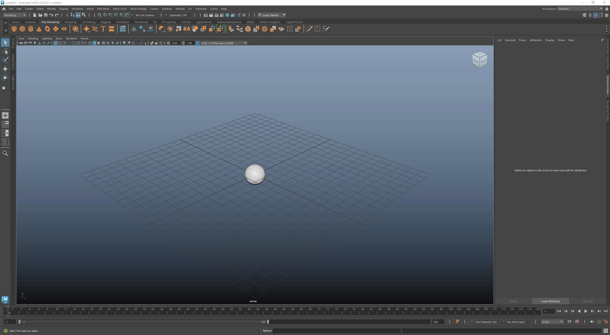

# Maya to Unreal Alembic I/O Tool

## Purpose:
### What Does It Do?
* Quickly and easily exports alembic cache files from your Maya Scene
* Allows users to batch import alembic cache files to Unreal projects efficiently

### Why?
* FBX animation must contain a skeleton, which at times can be less than ideal
* Alembics work with geometry caches, meaning any deformers from your 3D software is compatible
* This allows creative freedom to animate how you choose

### How Does it Work?
* Unreal needs certain parameters to be set in order for you alembics to import properly
* The Maya tool exports with these parameters, then the Unreal tool imports them accordingly

# Installation:
Download the ZIP file from the `<> code` button on the top right of the github page.
There are two separate GUIs used. One for Maya and one for Unreal.

## **Maya**
1. After unzipping the downloaded code, navigate to the `mayaTools` folder
2. Select and drag the `DRAG-N-DROP-IN-MAYA.py` file into the Maya viewport
3. You should see a confirmation dialog and the menu on the top bar 
4. The tools are ready for use (No restart necessary)

--

## **Unreal**
### Activate Python in your Project
1. Enable Python in your Unreal project ([Tutorial](https://youtu.be/PMOvQ7mPv8k?si=OMGj71u5L9fDlZzm&t=7))

2. After unzipping the downloaded code, navigate to the `unrealTools` folder

3. Move the `unrealTools` folder to `<Unreal_Project>/Scripts`- IE: MyProject/Scripts (If you don't have a Scripts folder, make one)

4. In Unreal, go to Edit > Project Settings and type "python" in the top search bar

5. Locate `Additional Paths` in the menu and click the `+` icon next to it. Copy the path to the `unrealTools` folder and paste in the `Additional Paths` text box - IE: MyProject/Scripts/unrealTools

NOTE: Moving the folder to your project's Scripts folder is only a suggestion. If you like, you can move the unrealTools folder wherever you prefer. Just as long as you make sure the Additional Paths location is set there. 

### Add the Blueprint
To add the Editor Utility Widget menu to you project, you must migrate it from a separate project.

1. Navigate to `unrealTools/Alembic_Import_Tool`

2. Open the `Alembic_Import_Tool.ueproject` file

3. In the project, select the `Alembic_Import_Tool` folder in the 
content browser

4. Right click on it and click `Migrate`, then click OK

5. Navigate to the `Content` folder of the project where you want the tool, select it and click `Select Folder`

6. Go back to the project you migrated to and locate the blueprint. Right click on it and click `Run Editor Utility Widget`

